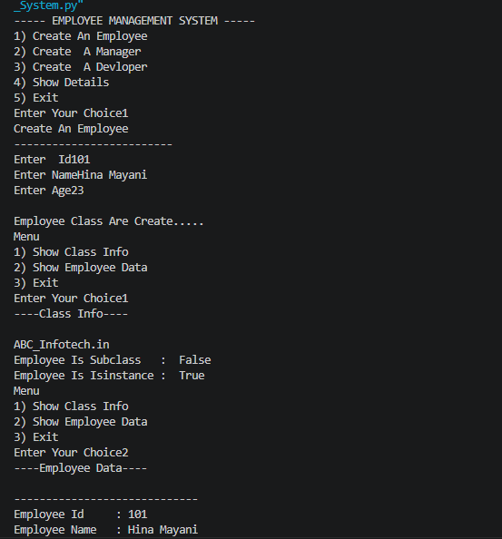
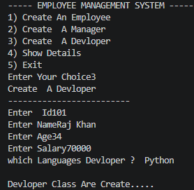
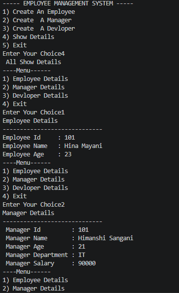
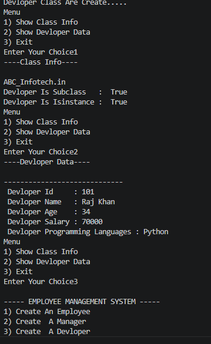
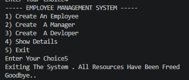

# Employee Management System

## Project Description

This project is a **Employee Management System** developed using Python Object-Oriented Programming (OOP) concepts. The system allows users to create and manage Employee, Manager, and Developer records, display their details, and demonstrate important OOP principles such as inheritance, abstraction, polymorphism, encapsulation, class methods, and object relationships.

## Objectives

* Create Employee, Manager, and Developer objects
* Store and display employee information
* Demonstrate abstraction using abstract classes
* Demonstrate inheritance and method overriding
* Implement encapsulation using private variables
* Use class methods and built-in OOP functions
* Provide a menu-driven user interface

## Features

* Create Employee records
* Create Manager records with department information
* Create Developer records with programming language information
* Display individual employee details
* Show company information using class methods
* Check inheritance relationships using `issubclass()`
* Check object types using `isinstance()`
* Menu-driven interactive system

## OOP Concepts Used

### Abstraction

* `Person` is an abstract class.
* `Display_Data()` is an abstract method that must be implemented by subclasses.

### Inheritance

* `Employee` inherits from `Person`.
* `Manager` and `Devloper` inherit from `Employee`.

### Polymorphism

* The `Display_Data()` method is overridden in different classes.

### Encapsulation

* Salary is stored using private variables (`__salary`).

### Class Method

* `info()` method displays company information.

## Assumptions

* The user enters valid input values.
* Employee ID and Age are numeric values.
* Manager and Developer are created before viewing their details.

## Project Structure

```text
project-folder/
│── Employee_Management_System.py
│── imag1.png
│── imag2.png
│── imag3.png
│── imag4.png
│── imag5.png
│── README.md

```







## Conclusion

This project provides practical experience with Python Object-Oriented Programming concepts. It demonstrates how abstraction, inheritance, polymorphism, and encapsulation can be used together to build a simple Employee Management System. The project is useful for beginners who want to strengthen their understanding of Python OOP and menu-driven applications.
